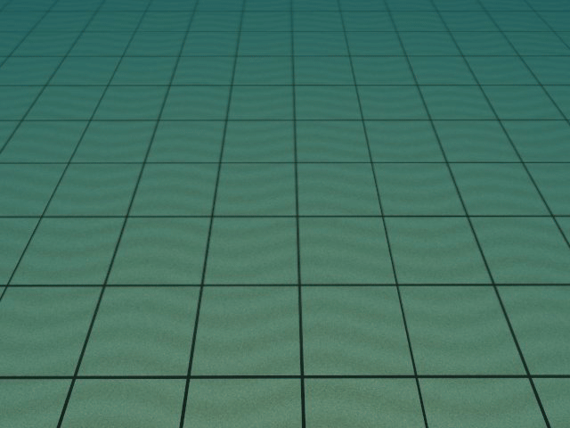

# Measured classroom release status — 2026-10-04

This template is publicly marked **Public template** on GitHub. The instructor platform used its native ARM64 local build for the following acceptance tests. See [course](course.md), [한국어 교재](course.ko.md), and [exact scoring](scoring.md).

| Native default ArduPilot task | Score / 100 | Coverage |
|---|---:|---|
| surface_station | 0.00 | 1 / 5 · provisional |
| surface_gates | 0.00 | 1 / 5 · provisional |
| surface_slalom | 21.11 | 1 / 5 · provisional |
| underwater_gate | 86.11 | 1 / 5 · provisional |
| underwater_path | 52.51 | 1 / 5 · provisional |
| underwater_return | 50.88 | 1 / 5 · provisional |

All six rows passed native motion-integrity, parameter and persistent-record checks. Zero means no ordered target/hold was completed under these rules, not a fabricated success. Each row is provisional; five distinct seeds are required for a ranked task. The surface track's three-task provisional mean is 7.04 and the underwater track's is 63.17.

The installed application was actually started on an M3 Pro Mac with native ARM64 Linux Docker containers and software rendering. Student ROS commands reached native propulsion (89 applied messages), sensor subscriptions received clock/odometry/IMU/lidar and 11 JPEG camera frames, and disconnect reset forces to zero. Central logout stopped native use in approximately 6 seconds. Idle restart did not reuse a stale request or charge usage. Runtime/rules/protocol digest checks match the server and reject mismatch. The shell installer completed; seven template unit tests passed.

The platform also checked two isolated server worlds, a third-user uncharged queue with ETA, five admitted web members, server-wall daily limits, six-calendar-month standalone Pro, scoped semester coupons, and loopback email delivery/verification. Live external email is not configured. Test-only accounts and temporary quotas are restored/disabled after review.

**Release limitation:** versioned public AMD64/ARM64 runtime images are not yet published. Windows/WSL2 and Linux NVIDIA overlay instructions are provided but not tested on GPU hardware in this Mac session. The small Python installer is usable with matching instructor-provided or locally built image tags; it is not evidence that all OS/GPU releases are downloadable. Mac Docker does not expose the Apple GPU to this Gazebo runtime.

충분히 검증한 범위: Mac 설치형 실제 구동·ROS 명령/센서·종료와 유휴 시간 차감, 서버 2개 독립 월드·대기열·사용량/권한·6개 과제의 기본 제어기 기록입니다. 과제별 1회 코스라 임시 점수이며 5회 확정 순위·Linux/Windows NVIDIA·공개 런타임 이미지·실서비스 메일은 별도 배포 검증이 필요합니다. 비정상 이동은 없었고 원본 POSIM에는 변경하지 않았습니다.

## Student underwater controller: measured follow-up

The actual template ROS depth controller delivered **859 native-applied commands**, reached **1.824m** for a 2m target and returned to the surface after its 45-simulation-second dive phase. Both camera topics delivered 85 compressed frames each; 42 inspection-camera JPEGs were saved. The simple PD controller retains about 0.18m depth offset and is an intentionally incomplete competition solution. No native motion-integrity fault occurred.

The test caught ROS shutting down its context before neutral cleanup on Ctrl+C. Both starter controllers now keep the context alive, cancel the control timer, publish neutral and then shut down. Actual BlueROV2 and the surface-controller interrupt smoke test both exited with status 0. A first harness run overwrote the sourced ROS Python path; the harness was corrected and the native run repeated.

Actual sensor pixels, **3× playback**, sampled about every 2 seconds. This is depth-hold/resurface practice, not a complete gate/slalom entry. 해저 격자가 가까워졌다 멀어지는 실제 ROS 수심 제어 시험이며, 약 0.18m 정상 오차가 남은 학습용 PD 예제입니다.
